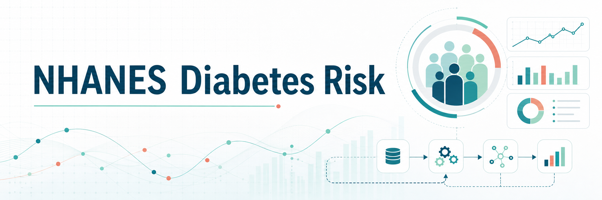
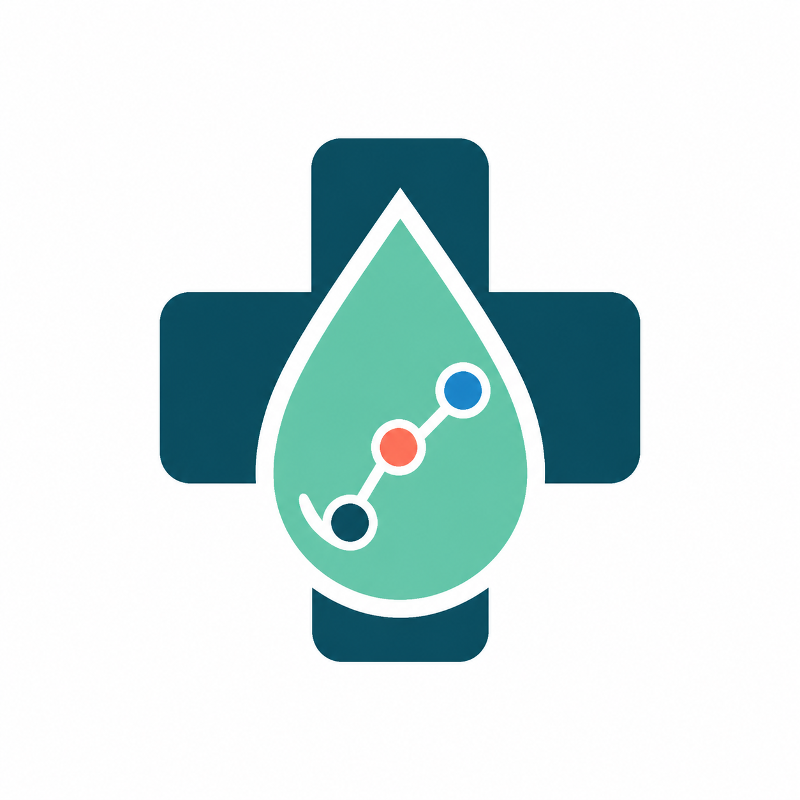

<p align="center">
  
</p>

<p align="center">
  
</p>

<h1 align="center">NHANES Diabetes Risk</h1>

<p align="center">
  Proyecto académico de ciencia de datos con Kedro para analizar factores asociados a diabetes y riesgo metabólico usando datos públicos de NHANES.
</p>

<p align="center">
  
  
  
  
</p>

---

## About

**NHANES Diabetes Risk** organiza un flujo reproducible para descargar, catalogar y preparar datos de salud poblacional del ciclo **NHANES August 2021-August 2023**. El foco del proyecto es construir una base técnica clara para análisis de riesgo de diabetes, integrando cuestionarios, datos demográficos, mediciones corporales y resultados de laboratorio.

El repositorio fue desarrollado para la **Evaluación Parcial N°3** de la asignatura **Programación para la Ciencia de Datos - SCY1101**.

> Este proyecto tiene fines académicos. No es una herramienta diagnóstica ni reemplaza evaluación médica profesional.

## Objetivos

- Descargar datasets oficiales de NHANES relacionados con diabetes y riesgo metabólico.
- Organizar las fuentes en un proyecto Kedro reproducible.
- Documentar variables clave para análisis clínico y poblacional.
- Preparar una base extensible para pipelines de limpieza, features y modelamiento.
- Mantener una estrategia de trabajo colaborativo con ramas `main`, `develop` y `feature/*`.

## Estado Del Proyecto

| Área | Estado | Detalle |
| --- | --- | --- |
| Estructura Kedro | En base inicial | Proyecto configurado con `pyproject.toml`, `conf/` y paquete en `src/`. |
| Descarga de datos | Disponible | Script `scripts/download_nhanes.py` para obtener archivos `.xpt`. |
| Catálogo de datos | Disponible | Datasets NHANES registrados en `conf/base/catalog.yml`. |
| Parámetros | Disponible | URL base, archivos esperados, target y llave de unión en `parameters.yml`. |
| Pipelines | Pendiente de implementación | Estructura preparada para sumar nodos de ingesta, limpieza, features y modelos. |
| Modelamiento | Roadmap | Clasificación de diabetes/riesgo metabólico con métricas reproducibles. |

## Fuentes De Datos

Los datos provienen de **NHANES - National Health and Nutrition Examination Survey**, programa público del National Center for Health Statistics.

| Archivo | Categoría | Uso principal |
| --- | --- | --- |
| `DIQ_L.xpt` | Questionnaire | Diabetes reportada, variable objetivo `DIQ010`. |
| `DEMO_L.xpt` | Demographics | Edad, sexo, raza/etnia e indicadores socioeconómicos. |
| `BMX_L.xpt` | Examination | BMI, peso, altura y circunferencia de cintura. |
| `GHB_L.xpt` | Laboratory | Hemoglobina glicosilada, variable `LBXGH`. |
| `GLU_L.xpt` | Laboratory | Glucosa plasmática en ayunas, variable `LBXGLU`. |

Llave de integración:

```text
SEQN
```

Variable objetivo inicial:

```text
DIQ010
```

## Arquitectura

```text
NHANES Public Data
        |
        v
scripts/download_nhanes.py
        |
        v
data/01_raw/*.xpt
        |
        v
Kedro Data Catalog
        |
        v
Pipelines
  - ingestion
  - cleaning
  - feature_engineering
  - modeling
  - reporting
        |
        v
Artifacts
  - datasets procesados
  - métricas
  - modelos
  - reportes
```

## Estructura Del Repositorio

```text
.
├── assets/
│   ├── banner.png
│   └── logo.png
├── conf/
│   ├── base/
│   │   ├── catalog.yml
│   │   ├── logging.yml
│   │   └── parameters.yml
│   └── local/
│       └── .gitkeep
├── data/
├── notebooks/
├── scripts/
│   └── download_nhanes.py
├── src/
│   └── nhanes_diabetes/
│       ├── __init__.py
│       ├── __main__.py
│       ├── pipeline_registry.py
│       ├── settings.py
│       └── pipelines/
├── .gitignore
├── pyproject.toml
├── README.md
└── requirements.txt
```

## Instalación

Crear y activar entorno virtual:

```bash
python -m venv .venv
.venv\Scripts\activate
```

Instalar dependencias:

```bash
python -m pip install --upgrade pip
pip install -r requirements.txt
```

Validar Kedro:

```bash
kedro info
```

## Uso Rápido

Descargar los archivos NHANES:

```bash
python scripts/download_nhanes.py
```

Ejecutar el proyecto Kedro:

```bash
kedro run
```

Ejecutar el paquete como comando:

```bash
nhanes-diabetes
```

## Configuración Kedro

Los datasets crudos están definidos en:

```text
conf/base/catalog.yml
```

Los parámetros centrales están en:

```text
conf/base/parameters.yml
```

Parámetros destacados:

```yaml
nhanes_base_url: "https://wwwn.cdc.gov/Nchs/Data/Nhanes/Public/2021/DataFiles"
target_column: "DIQ010"
merge_key: "SEQN"
```

## Variables Relevantes

| Variable | Descripción |
| --- | --- |
| `SEQN` | Identificador único de participante. |
| `DIQ010` | Diagnóstico reportado de diabetes. |
| `RIDAGEYR` | Edad. |
| `RIAGENDR` | Sexo. |
| `RIDRETH3` | Grupo racial/étnico. |
| `BMXBMI` | Índice de masa corporal. |
| `BMXWAIST` | Circunferencia de cintura. |
| `LBXGH` | Hemoglobina glicosilada HbA1c. |
| `LBXGLU` | Glucosa plasmática en ayunas. |

## Roadmap Técnico

- Implementar pipeline de ingesta con validación de archivos.
- Construir pipeline de limpieza para nulos, duplicados y códigos especiales NHANES.
- Crear features clínicas: categoría BMI, grupo etario, riesgo por HbA1c y glucosa.
- Entrenar modelos base con `scikit-learn`.
- Exportar métricas, matriz de confusión e importancia de variables.
- Agregar pruebas automatizadas con `pytest`.
- Incorporar dashboard y API cuando el pipeline de datos esté estable.

## Flujo Git Recomendado

El repositorio usa una estrategia colaborativa simple:

| Rama | Propósito |
| --- | --- |
| `main` | Versión estable del proyecto. |
| `develop` | Integración de avances antes de liberar a `main`. |
| `feature/a` | Trabajo de pipelines, datos, limpieza, features y modelos. |
| `feature/b` | Trabajo de documentación, visualización, API y despliegue. |

Flujo esperado:

```text
feature/a ─┐
           ├──> develop ───> main
feature/b ─┘
```

Convención sugerida de commits:

```text
docs: update readme
feat: add ingestion pipeline
fix: handle missing values
test: add data validation tests
chore: update project config
```

## Buenas Prácticas

- No versionar datos crudos ni procesados.
- Mantener credenciales fuera del repositorio.
- Documentar cambios relevantes en commits pequeños.
- Ejecutar validaciones antes de integrar a `develop`.
- Separar trabajo técnico por ramas `feature/*`.

## Reproducibilidad

El proyecto concentra rutas y parámetros en configuración Kedro para que el flujo pueda repetirse en otros equipos. Los datos descargados se guardan bajo `data/01_raw/`, pero esa carpeta se mantiene fuera de Git para evitar subir archivos pesados o sensibles.

## Limitaciones

- NHANES es una encuesta poblacional y no una historia clínica individual.
- Algunas variables son autoinformadas.
- El target inicial `DIQ010` representa diagnóstico reportado, no diagnóstico calculado por el proyecto.
- Las métricas finales dependerán de la implementación futura de limpieza, features y modelamiento.

## Equipo

| Rol | Responsabilidad |
| --- | --- |
| Data Engineering | Descarga, catálogo, ingesta y limpieza. |
| Data Science | Features, modelos, métricas y validación. |
| Producto / Documentación | README, evidencias, presentación y guía de uso. |

## Licencia Y Uso

Repositorio académico para práctica de ciencia de datos reproducible con Kedro, Python y fuentes públicas de salud. Los datos pertenecen a NHANES/NCHS/CDC y deben utilizarse respetando sus condiciones oficiales de uso.
